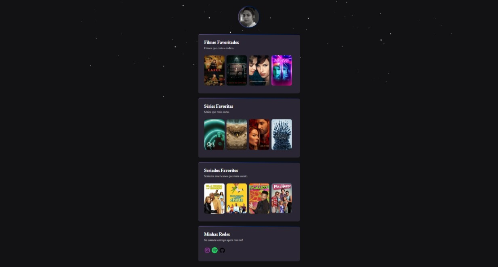

# 𝙉𝙇𝙒 𝘾𝙃𝘼𝙇𝙇𝙀𝙉𝙂𝙀 🚀

## 𝐃𝐄𝐒𝐂𝐑𝐈ÇÃ𝐎

> Projeto desenvolvido pós evento Next Level Week da Rocketseat. Segundo projeto realizado com base nos ensinamentos do evento NLW, utilizando o site [Swiper JS](https://swiperjs.com/) como método para aplicações de Demos, deixando o projeto mais dinâmico.

[🔗 Clique aqui para acessar](https://elizabetegarcia.github.io/nlw-challenge/)

## 𝐓𝐄𝐂𝐍𝐎𝐋𝐎𝐆𝐈𝐀

▸ HTML

▸ CSS

▸ Git e Github

## 📧 𝐂𝐎𝐍𝐓𝐀𝐓𝐎

 elizabetegarcia934@gmail.com